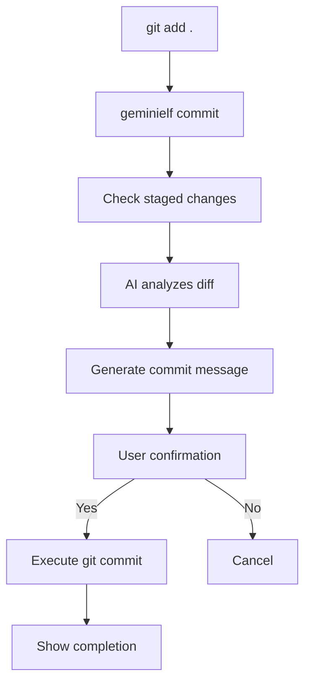

# 🚀 geminielf

geminielf is a Go-based CLI tool that automatically generates Git commit messages using Vertex AI (Gemini). It analyzes staged changes and generates appropriate commit messages through a modern, interactive TUI interface built with Bubble Tea.

## ✨ Features

- 🤖 **AI-Powered**: Intelligent commit message generation using Vertex AI (Gemini)
- 🎨 **Modern TUI**: Beautiful and interactive user interface built with Bubble Tea
- ⚡ **Fast Processing**: Real-time progress visualization with dynamic progress bars
- 🛡️ **Safe Operations**: Only operates on staged changes for secure workflow
- 🌐 **Cross-Platform**: Works seamlessly across different operating systems

## 🛠️ Installation

### Prerequisites

- Go 1.24.3 or higher
- Google Cloud account with Vertex AI API enabled
- Git (required for commit operations)

### Build from Source

```bash
git clone https://github.com/EkeMinusYou/geminielf.git
cd geminielf
go build
```

### Install Binary

```bash
go install
```

## ⚙️ Setup

### 1. Google Cloud Authentication

To use the Vertex AI API, configure the following environment variables:

```bash
# Path to your service account key file
export GOOGLE_APPLICATION_CREDENTIALS="/path/to/your/service-account-key.json"

# Google Cloud project ID
export VERTEXAI_PROJECT="your-project-id"

# Vertex AI location (optional, default: us-central1)
export VERTEXAI_LOCATION="us-central1"

# Gemini model to use (optional)
export GEMINIELF_DEFAULT_MODEL="gemini-2.5-flash-preview-05-20"
```

### 2. Service Account Setup

1. Create a service account in Google Cloud Console
2. Grant the "Vertex AI User" role
3. Download the JSON key file
4. Set the `GOOGLE_APPLICATION_CREDENTIALS` environment variable to the file path

## 🚀 Usage

### Basic Workflow

1. Stage your changes:
```bash
git add .
```

2. Run geminielf:
```bash
geminielf commit
```

3. Interactive TUI operations:
   - Review the AI-generated commit message
   - Press `y` to approve or `n` to cancel
   - The commit will be executed automatically upon approval

### Command Options

```bash
# Show help
geminielf --help

# Show commit subcommand help
geminielf commit --help
```

## 🎯 Workflow



## 🔧 Technical Specifications

### Architecture

- **Target**: Staged changes only (`git diff --staged`)
- **AI Provider**: Vertex AI (Gemini models)
- **Default Model**: gemini-2.5-flash-preview-05-20
- **UI Framework**: Bubble Tea (TUI)
- **CLI Framework**: Cobra

### Project Structure

```
cmd/
├── root.go          # Root command definition
└── commit.go        # Commit subcommand implementation
internal/
├── git/
│   └── diff.go      # Git operations (git diff --staged)
├── ai/
│   └── vertex.go    # Vertex AI integration
├── ui/
│   └── tui.go       # Bubble Tea TUI implementation
└── config/
    └── config.go    # Configuration management
main.go             # Application entry point
```

## 🎨 TUI Screens

### Loading Screen
```
┌─────────────────────────────────────┐
│ 🚀 geminielf                        │
│ ⠙ Generating commit message...     │
│                                     │
│ 🧠 AI is analyzing your changes... │
│ ████████████▒▒▒▒ 75%              │
└─────────────────────────────────────┘
```

### Confirmation Screen
```
┌─────────────────────────────────────┐
│ 🚀 geminielf                        │
│                                     │
│ 📝 Generated Commit Message:       │
│ ┌─────────────────────────────────┐ │
│ │ feat: add user authentication   │ │
│ │ system with JWT support         │ │
│ └─────────────────────────────────┘ │
│                                     │
│ 🤔 Commit with this message?       │
│ ✓ Yes (y)  ✗ No (n)               │
│ Press 'y' to commit or 'n' to cancel │
└─────────────────────────────────────┘
```

### Success Screen
```
┌─────────────────────────────────────┐
│ 🚀 geminielf                        │
│                                     │
│ 🎉 Success!                        │
│                                     │
│ ✨ Your changes have been committed │
│ successfully!                       │
│                                     │
│ 📝 Committed with message:         │
│ ┌─────────────────────────────────┐ │
│ │ feat: add user authentication   │ │
│ │ system with JWT support         │ │
│ └─────────────────────────────────┘ │
│                                     │
│ 🚀 The AI-generated message has    │
│ been applied.                       │
└─────────────────────────────────────┘
```

## 🌍 Environment Variables

| Variable | Description | Default Value | Required |
|----------|-------------|---------------|----------|
| `GOOGLE_APPLICATION_CREDENTIALS` | Path to service account key file | - | ✅ |
| `VERTEXAI_PROJECT` | Google Cloud project ID | - | ✅ |
| `VERTEXAI_LOCATION` | Vertex AI location | `us-central1` | ❌ |
| `GEMINIELF_DEFAULT_MODEL` | Gemini model to use | `gemini-2.5-flash-preview-05-20` | ❌ |

## 🔨 Development

### Development Environment Setup

```bash
# Install dependencies
go mod download

# Build the project
go build

# Run tests
go test ./...

# Tidy dependencies
go mod tidy
```

### Available Commands

```bash
go build                  # Build the project
go test ./...             # Run tests
go mod tidy               # Tidy dependencies
go run main.go commit     # Run in development
```

## 📦 Dependencies

### Main Dependencies
- [`cloud.google.com/go/vertexai`](https://pkg.go.dev/cloud.google.com/go/vertexai) - Vertex AI client
- [`github.com/charmbracelet/bubbletea`](https://github.com/charmbracelet/bubbletea) - TUI framework
- [`github.com/charmbracelet/lipgloss`](https://github.com/charmbracelet/lipgloss) - Styling and layout
- [`github.com/charmbracelet/bubbles`](https://github.com/charmbracelet/bubbles) - TUI components
- [`github.com/spf13/cobra`](https://github.com/spf13/cobra) - CLI framework

## 🤝 Contributing

Pull requests and issues are welcome!

1. Fork this repository
2. Create a feature branch (`git checkout -b feature/amazing-feature`)
3. Commit your changes (`git commit -m 'Add amazing feature'`)
4. Push to the branch (`git push origin feature/amazing-feature`)
5. Create a pull request

## 📄 License

This project is licensed under the MIT License. See the [LICENSE](LICENSE) file for details.

## 🙏 Acknowledgments

- [Bubble Tea](https://github.com/charmbracelet/bubbletea) - For enabling beautiful TUI experiences
- [Vertex AI](https://cloud.google.com/vertex-ai) - For providing powerful AI capabilities
- [Cobra](https://github.com/spf13/cobra) - For excellent CLI experience

---

**Made with ❤️ by [EkeMinusYou](https://github.com/EkeMinusYou)**